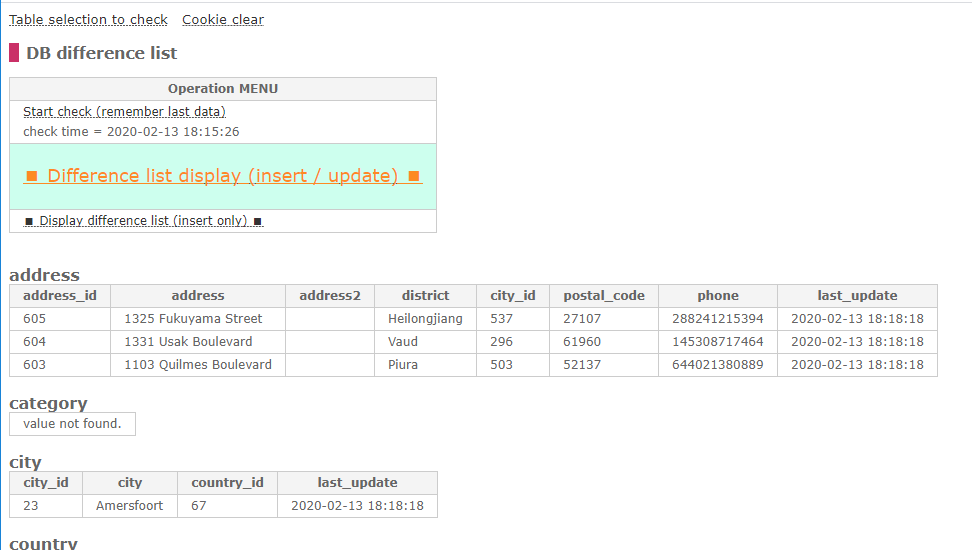
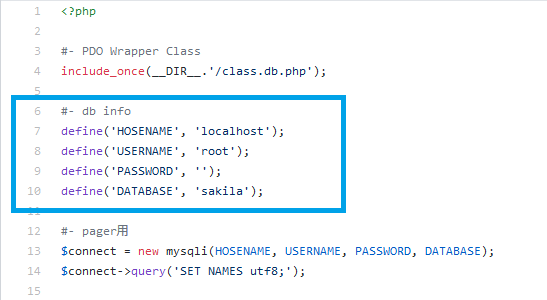
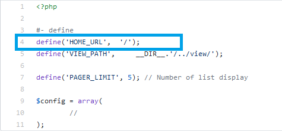

# ers_dev_5_db_diff
Create DB Diff display tool using ers.dev.v.0.5

|Description|Screenshot|
----|----
|All tables in the specified DB will be displayed.  From there,  select the table you want to check for differences.||
|The last ID of the playmary key of each table  and the current time are stored in a cookie  for checking.||
|Start checking.  The inserted and updated records are displayed.||

|Setup|Screenshot|File|
----|----|----
|Database||db_diff/inc/db.inc.php|
|Sub directory||db_diff/check_tables.inc.php|
|Group table|There is no problem if you do not fix it.|db_diff/inc/config.inc.php|
